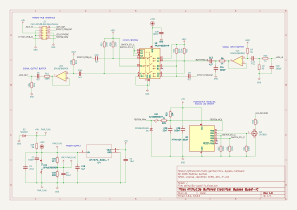

// SPDX-License-Identifier: CERN-OHL-P-2.0

= ATtiny13A Buffered Electrical Bypass Quasi-IC

== Background

After several years of building effects pedals, I've converged on a
personal favorite bypass scheme: electrical analog switching with
control by a microcontroller, along with buffered input and output.
This is conceptually similar to most Boss compact pedals (although
they tend to use discrete JFETs for the input buffer and actual
circuit switching, the logic is a discrete "crossbar"-BJT scheme,
and the output buffer is typically a BJT).

I typically design through-hole effect PCBs; however, my preferred
bypass scheme consumes a fair amount of PCB space: two 8-pin DIP ICs
(opamp buffers, MCU), a 16-pin DIP switching IC (CD4053), and all
the supporting circuitry.  Besides the PCB footprint, it's also a
_time_ cost, as I often end up tweaking the bypass layout to match
with the actual effect layout.

I thought to myself, it would be nice to have a single integrated
circuit that did what I wanted, that I could use in a plug-and-play
fashion.  This would save PCB space and layout time.  Of course, no
such IC exists, so I did the next-best thing and tried to make a
small, surface-mount based PCB that could be used just like an IC -
so I call it a "quasi-IC".  With PCB fabrication and SMD assembly
done via contract, I can now keep an inventory of small
plug-and-play PCBs that mate to the parent PCB.

This project represents my initial working prototype of the
quasi-IC.

== Schematic

link:attiny13a-quasi-ic.pdf[Downloadable PDF]

== Module Pinout

The module plugs into its parent PCB through two rows of five pins,
2.54 mm pitch, with the rows 31.00 mm apart.  The pins are numbered
like a DIP IC: counter-clockwise from pin 1, viewed from the
component side.

....
                +-----------+
       JACK_IN  | 1      10 |  JACK_OUT
           GND  | 2       9 |  EFFECT_PCB_OUT
           +9V  | 3       8 |  GND
           GND  | 4       7 |  LED_CATHODE
 EFFECT_PCB_IN  | 5       6 |  FOOTSW_RAW
                +-----------+
....

[cols="1,2,6",options="header"]
|===
| Pin | Signal | Description

| 1
| JACK_IN
| Signal input, from the input jack; goes to the input buffer

| 2, 4, 8
| GND
| Ground (0-volt)

| 3
| +9V
| Supply input; the module has a reverse-polarity shunt diode (D2)
and a 22 Ω series resistor (R5) on this pin

| 5
| EFFECT_PCB_IN
| Buffered signal to the effect circuit's input, switched by the
TMUX4053 and AC-coupled (C10)

| 6
| FOOTSW_RAW
| Momentary, normally-open footswitch to ground; the pull-up, ferrite
bead, RC filter and ESD protection are on the module

| 7
| LED_CATHODE
| Status LED cathode, switched to ground by Q3 through a 4.7 kΩ
resistor (R26) on the module.  Connect the LED's anode to the supply;
the parent PCB _may_ need additional current-limiting resistance,
depending on desired LED brightness and/or LED type (I typically add
an additional 3.3 kΩ for ultrabright/high-efficiency LEDs)

| 9
| EFFECT_PCB_OUT
| The effect circuit's output, returning to the module; AC-coupled
(C9)

| 10
| JACK_OUT
| Buffered signal output, to the output jack
|===

// TODO: supply voltage range and typical current draw.

== Design Overview

The "brains" of this module is a SOIC-8 ATtiny13A microcontroller.
The MIT-licensed firmware - including design documentation and an
extensive test and validation suite - is available here:
https://github.com/matt-garman/mcu-bypass-firmware[mcu-bypass-firmware].

Input and output buffering is provided by an OPA1678 opamp in a
WSON-8 package.  This is a modern high-quality opamp whose
specifications surpass effectively all readily available
through-hole opamps.  It should have no audible impact on the
signal.  Using this opamp at the effect's input provides for a
consistently high impedance (effectively zero load for even
low-output guitar pickups).  Using the other half at the effect's
output provides for a consistently low impedance, to easily drive
the next effect in the chain, a long cable, or the amp itself.

Actual signal switching is done by the TMUX4053, which is an
upgraded version of the CD4053, only available in surface mount;
here I'm using the 16-pin TSOT-23 (TI "DYY") version.

The module is wired for the "4053 with mute" scheme: the MCU
firmware implementation plus circuit wiring create three distinct
states: bypass, engage, mute.  When responding to a footswitch
press, the MCU first switches the TMUX4053 to the mute state for
five milliseconds, then switches to engage or bypass.  The brief
muting seeks to minimize or even eliminate popping often associated
with engage/bypass switching.

The MCU and TMUX4053 control signals run at 5v.  The 5v supply is
provided by the AP7375 LDO.  This is a modern regulator with a _very_
low dropout voltage and extremely low quiescent current.

The design takes a "belt-and-suspenders" approach to footswitch
debounce and EMI/RFI resiliency:

* the footswitch hardware wiring includes a ferrite bead and an
  RC filter
* the ATtiny13A has Schmitt Trigger inputs
* the actual debounce algorithm implemented in firmware is
  abstracted into a provably-correct _pure_ implementation; the
  actual firmware has been exhaustively tested to survive all
  but the most adverse/unusual circumstances

== Modifying

The KiCad project is
link:attiny13a-quasi-ic.kicad_pro[attiny13a-quasi-ic.kicad_pro],
in this directory.  KiCad version 10.0.5 was used.

== Build Reports

  * link:https://forum.pedalpcb.com/threads/dynamic-haircut-v2-0-barber-gain-changer.29479/post-393071[Dynamic Haircut v2.0]
  * link:https://forum.pedalpcb.com/threads/old-fashioned-skreddy-animals-major-overdrive.28763/post-395652[Old Fashioned v2.0]

