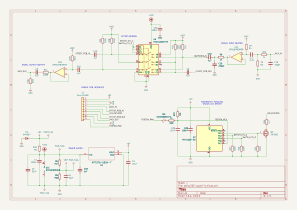

// SPDX-License-Identifier: CERN-OHL-P-2.0

= ATtiny202 Buffered Electrical Bypass Quasi-IC

== Overview

See the sister project
link:../attiny13a-buffered-electrical-bypass-quasi-ic/[attiny13a-buffered-electrical-bypass-quasi-ic]
for a detailed discussion of this design.  The design intent and
functionality of the two modules are identical.  That is, this
module is intended to offer the same "plug and play" convenience of
an integrated circuit, one that offers analog signal
buffering and switching, as well as engage/bypass state management
and status LED lighting/darking.

The differences are:

  * This project uses the ATtiny202 microcontroller, whereas the
    other uses ATtiny13a.  The actual firmware behavior is the same;
    the source itself differs only in the obligatory
    hardware-specific details.
  * This PCB design is much smaller, with a 43x16mm footprint
  * This design is a 4-layer PCB, whereas the other is 2-layer
  * This PCB uses a single row of pin headers, with the idea of
    supporting vertical mounting (i.e. perpendicular to the parent
    effect PCB)

== Schematic

link:attiny202-quasi-ic.pdf[Downloadable PDF]

== Module Pinout

The module plugs into its parent PCB through a single row of nine
pins, 2.54 mm pitch.  The pins are numbered 1 through 9,
left-to-right, as viewed from the component side.

....
   1 | 2 | 3 | 4 | 5 | 6 | 7 | 8 | 9
  VDC|GND|JIN|SND|LSW|RET|JOU|GND|FSW
....

[cols="1,2,6",options="header"]
|===
| Pin | Signal | Description

| 1
| VDC
| Supply input; the module has a reverse-polarity shunt diode (D2)
and a 22-ohm series resistor (R5) on this pin

| 2, 8
| GND
| Ground (0-volt)

| 3
| JIN
| Signal input, from the input jack; goes to the input buffer

| 4
| SND
| Buffered signal to the effect circuit's input, switched by the
TMUX4053 and AC-coupled (C10)

| 5
| LSW
| Status LED cathode, switched to ground by Q3 through a 4.7k-ohm
resistor (R26) on the module.  Connect the LED's anode to the supply;
the parent PCB _may_ need additional current-limiting resistance,
depending on desired LED brightness and/or LED type (I typically add
an additional 3.3k-ohm for ultrabright/high-efficiency LEDs)

| 6
| RET
| The effect circuit's output, returning to the module; AC-coupled
(C9)

| 7
| JACK_OUT
| Buffered signal output, to the output jack

| 9
| FSW
| Momentary, normally-open footswitch to ground; the pull-up, ferrite
bead, RC filter and ESD protection are on the module
|===

// TODO: supply voltage range and typical current draw.

== Modifying

The KiCad project is
link:attiny202-quasi-ic.kicad_pro[attiny202-quasi-ic.kicad_pro],
in this directory.  KiCad version 10.0.5 was used.

== Build Reports

  * link:https://forum.pedalpcb.com/threads/nashville-nobility-custom-nobels-odr-1bc.30339/[Nashville Nobility]

